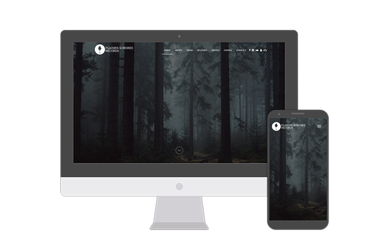
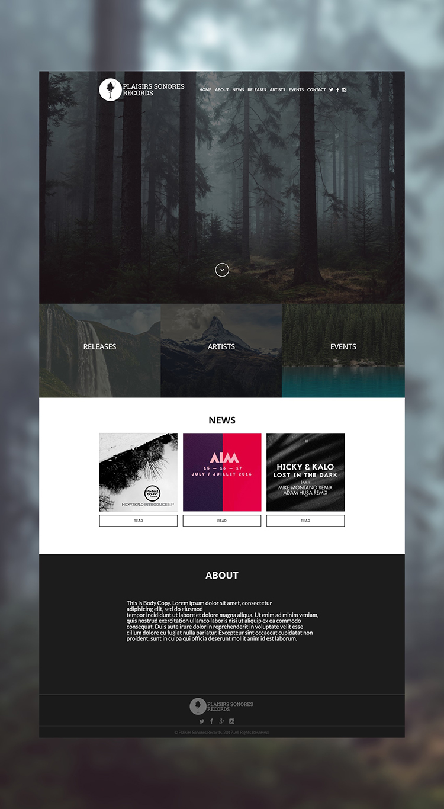
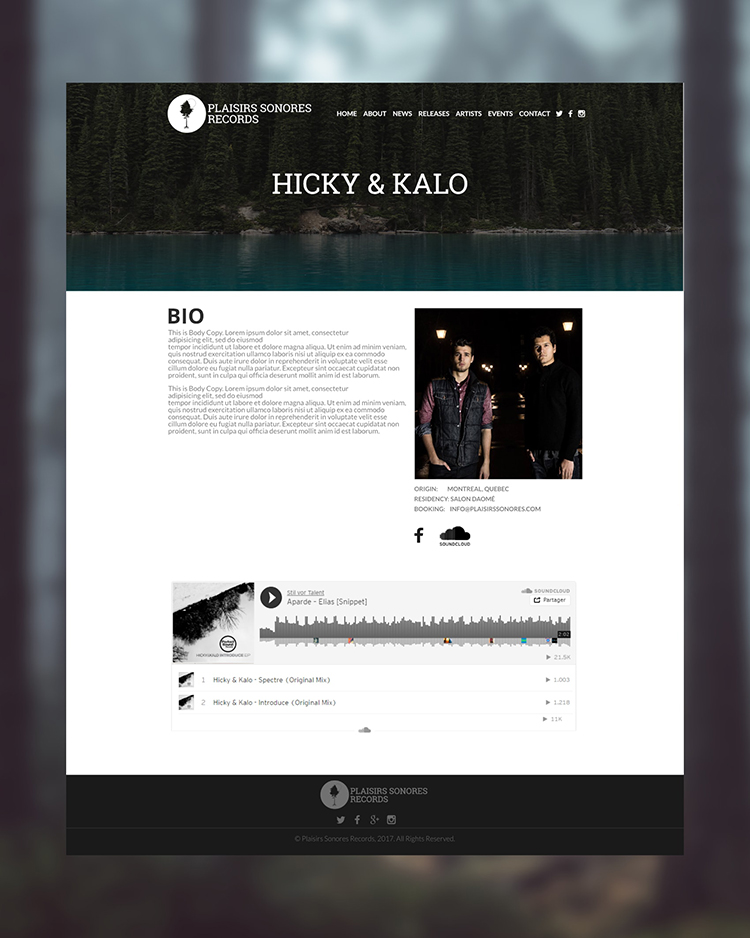
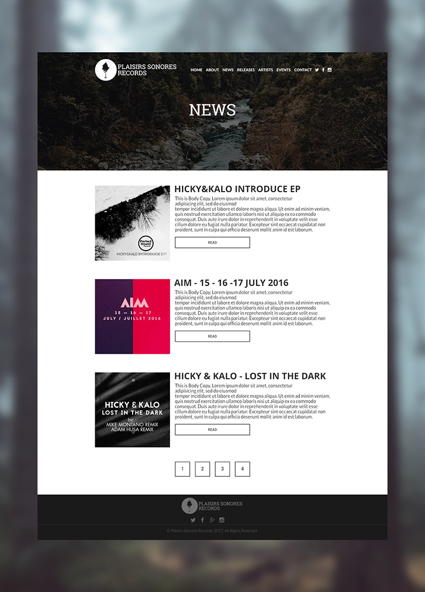

## Technical information:
- Backend: 
    - Grav CMS
- Frontend: 
    - Bootstrap3
    - gulp
    - twig

## Description
Plaisirs sonores is a young label of electronic music. As they describe themselves on their website:

> In a consumer world like ours, electronic music has become a disposable and generic product. Plaisirs Sonores Records tries to distance itself from this industry by carefully selecting emergent and original artists who come from everywhere around the globe. These new talents are paired with artists of greater experience to bring a new perspective to their original work. The result is a quality music endowed with emotions that cannot be consumed as a simple good.

The mandate of this project was to establish Plaisirs Sonores Records as a brand. To define their general image and create a website according to that branding.

I helped them decide general guidelines for their brand's image such as:
    - Ways to use their logo
    - Typography
    - Color palettes
    - Shapes

Having created that toghether, we were then ready to proceed to the design of the website. They were looking for a fresh, young and professionnal look. They also wanted to represent the origins of the label, the province of Quebec, by using pictures displaying different kinds of landscapes we can find there.

They also had specific needs that required a bit more technical work on the backend:
    - They wanted to be able to update the content of the website themselves in an easy manner.
        - By adding new artists
        - Writing news posts
        - Being able to list their upcoming events

In order to fulfill their technical needs I decided to use the Grav CMS. Using Grav allowed me to quickly develop
an easy system for them to use in order to manage the content of the site. By providing special buttons in the administration panel to 
create news artists or news post.

For the upcoming events system, they are automatically fetched from their facebook page. Therefore they only have to create events on facebook
to see them be automatically added to the website.

## Concepts
These are concept images of the approved design

*Home page*

*A sample artist page*

*News page*