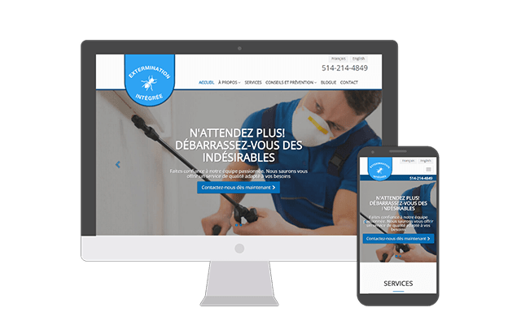
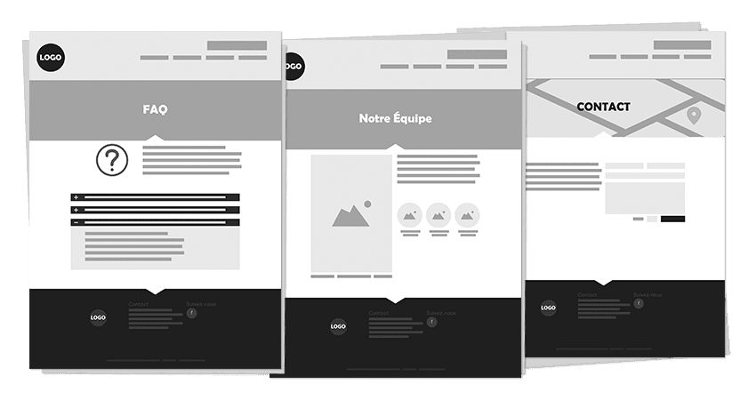
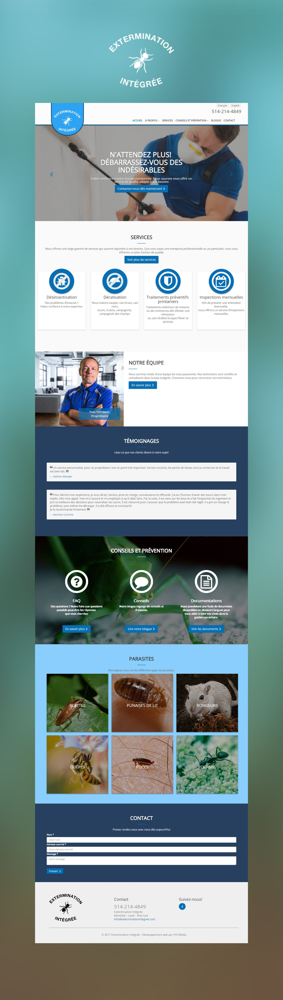

*Visit Website: [http://exterminationintegree.com](http://exterminationintegree.com?target=_blank)*

## Technical information:
- Backend: 
    - PHP
    - Grav CMS
- Frontend: 
    - Bootstrap 3
    - SASS
    - Gulp
    - Twig

## Description

Extermination Intégrée is a Montreal based Pest control company, that needed to have their website redesigned.
The owner, had tried some *do it yourself options* but remained unsatisfied with the results. Extermination Intégrée
wanted a professional look, that conveyed confidence but most of all honesty. They were looking for a platform
to help them promote their services as well as providing information to their clients and potential clients on
how to make the right choices when stuck with pest problems.

The owner needed to have an easy way to add new documents, blog posts, and tips and 
tricks to the website and this in both english and french.

In order to accomplish this, I initially tought to use Wordpress as it seemed to be a fit choice
offering both blog and multilingual capabilities out of the box for the former and through plugins for the latter. 
However the documentation part would have required me to create a custom plugin which would have added to the cost.
Instead I decided to use Grav, which offers so much flexibility to the programmer out of the box that it proved a better choice.
Not only was the multilingual support easier to integrate, the blog and document managment capabilites a breeze to implement.
The performance of the webstie was also greatly improved compared to a Wordpress installation. Not only that it did not require
the use of a database reducing the hosting and maintance cost for the client.

## Colors and Typography

    

        
Open Sans

        
Aa

        
A B C D E F G H I J K L M N O P Q R S T U V W X Y Z 1 2 3 4 5 6 7 8 9

    

    

        

        
Deep Cerulean

        
#056EB5

    

    

        

        
Cloud burst

        
#1B2845

    

    

        

        
Abbey

        
#505153

    

    

        

        
Alabaster

        
#FCFCFC

    

# Visuals

*First step to design was creating the layouts using wireframe*

*Then the general design*