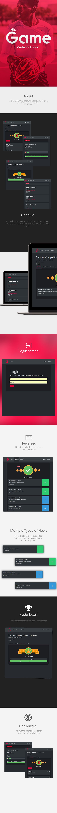

<!--  -->

    <a href="https://github.com/jwillp/thegame-frontend" class="btn btn-ghost" target="_blank"><i class="fa fa-github" aria-hidden="true"></i> View FrontEnd on Github</a>
    <a href="https://github.com/jwillp/thegame-backend" class="btn btn-ghost" target="_blank"><i class="fa fa-github" aria-hidden="true"></i> View Backend on Github</a>

 

TheGame is a web app allowing its users to create friendly competitions of challenges amongst themselves and attributing points in the event of the completion of a challenge.

---

# Technical details
- Backend:
    - PHP
    - Symfony2
- Frontend:
    - Bootstrap 3
    - SASS
    - Webpack
    - Vue.js
    - NPM
    - Node.js

## Description
The initial goal of this project was to create a platform that allowed my friends and I to create games (competitions) of challenges. These games could last a week, a summer or even a year, mostly in the context of sport. For instance we'd have some Parkour/Freerun related challenges like The one who did the most front flips or back flips etc. For each challenge there would be a number of points associated with each completion of a challenge. The winner being the one with the msot points at the end of the game's duration.

The first version was a classic web app with html pages. In order to learn how to create a RESTfulish API using Symfony and a single page app using Vue.js I created a new version of the project which is divided into 2 repositories: frontend & backend.

Here are the currently implemented features (both backend & frontend):

Note: A Game should be seen as a container of challenges. It is like a competition with many challenges.

## Features
### Users
- User registration
- User login

### Game Management Features
- CRUD Games
    - Description
    - Title
    - Visibility
- Visilbilty settings for games (private and public games)
- Specify administrators of games (Allowing them to update or delete the game)
- Specify users that can participate in a game
- Creating challenges
- Completing a challenge
- Canceling a challenge's success
- Displaying a leaderboard

### Newsfeed
- Global newsfeed displaying the different actions commited by users such as:
  - A user creating a game
  - A user completing a challenge
  - A user canceling a challenge completion
  - A user creating a new challenge
  - A user updating a challenge's points
  - etc.
- Per game newsfeed displaying the different actions commited by users relatively to that game

## Design

*Design concept*
