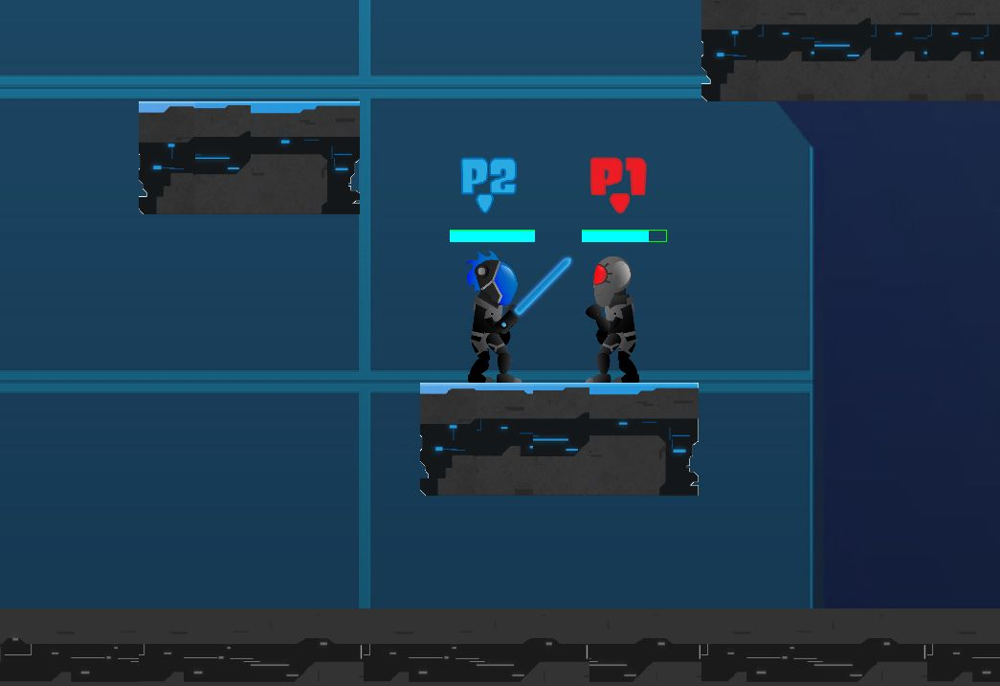
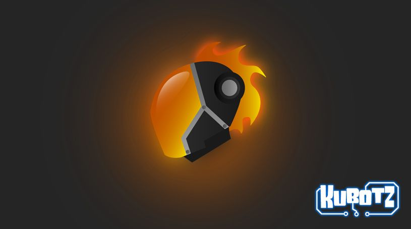
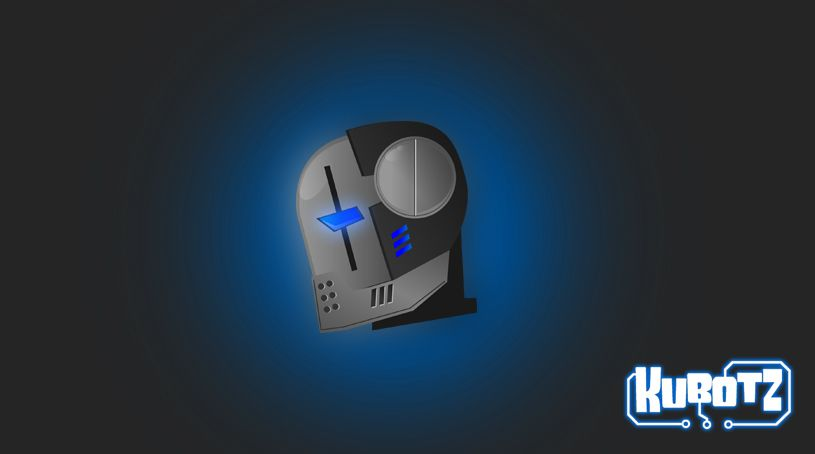
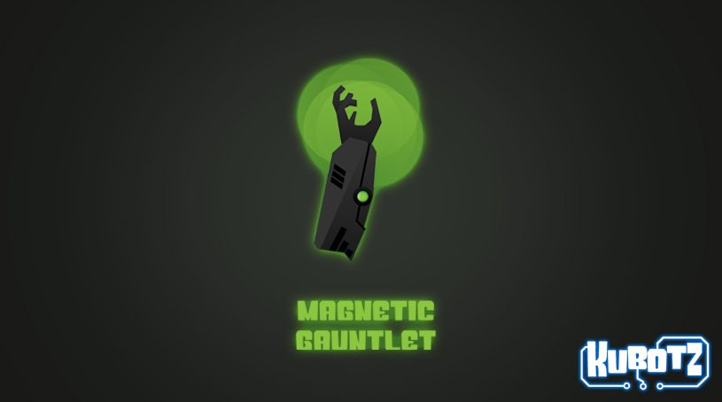

<!--  -->

    <a href="https://github.com/jwillp/Kubotz" class="btn btn-ghost" target="_blank"><i class="fa fa-github" aria-hidden="true"></i> View on Github</a>

 

Kubotz is a 2D cross-platform fighter game developped in Java using the libGDX library. Being based on libGDX it works on Windows, Linux, Mac OS X, Android, WebGL enabled browsers and iOS.

# Technical details
* Programming language: Java
* IDE: IntelliJ
* 3rd party: LibGDX
* Dependency manager: Gradle
* Physics library: Box2D
* Version Control: Git + Github
* Level Editor: Tiled Map Editor
* 2D animation library: Spriter pour Java
* Software Architecture:
    * Entity Component System (ECS)
    * Programmation Orientée Objet (POO)
* AI:
    * Behaviour Tree
    * A * Pathfinding

## Description
The player finds himself at the controls of a technological machine of unknown nature called Kubotz. He quickly realizes the invaluable possibility that is at his disposal: the personalization of his machine using interchangeable parts. The new attachments allow the Kubotz to achieve extraordinary functionality, such as control over its own reactivity to gravity, flaming spears, electric spraying, energy shield, laser swords and much more!

The battle takes place in a sometimes platonic / catatonic and static environment, and at other times in a highly hostile and dynamic battleground.

The player having accomplished his mission when all of his multiple opponents are neutralized.

---

## Screenshots

*Sword fight*

*In game level editor + lighting test*

## Artwork

