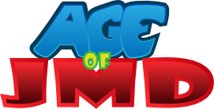
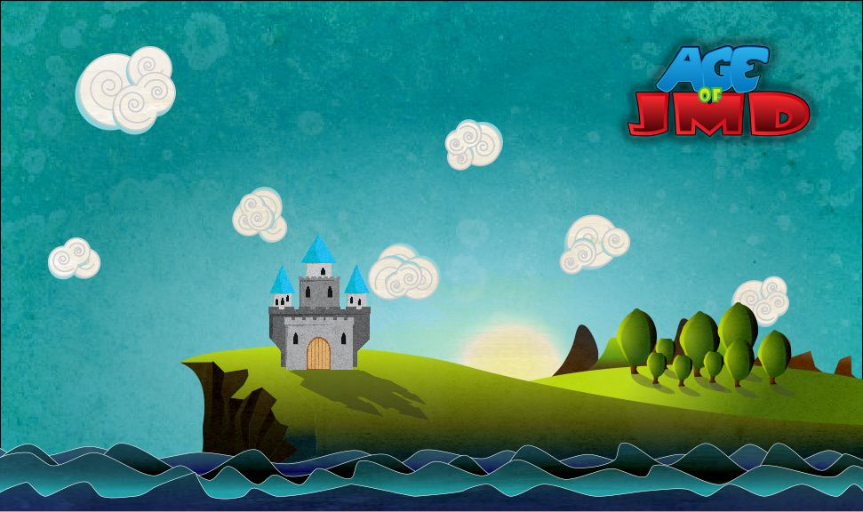
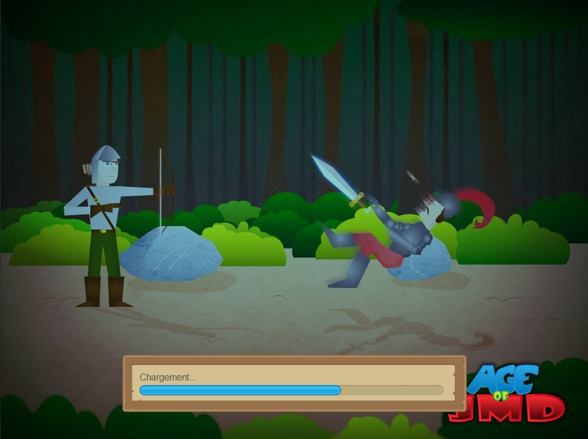
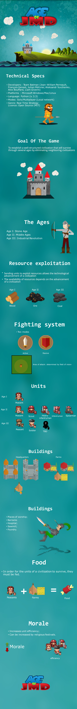

    <a href="https://github.com/TeamBatman/AgeOfJMD" class="btn btn-ghost" target="_blank"><i class="fa fa-github" aria-hidden="true"></i> View on Github</a>

# Technical details
- Programming language: Python
- Networking: Pyro4
- GUI: tkinter

## Description
Age of JMD is a real time strategy game playable over local network and programmed in Python. 
Each playable game allowed up to 9 simultaneous players. It was an assignment where we had to create such a game in a team of 5-6 developers. 
The development was to be done using the agile development method and following a strict MVC model.

## Responsibilities
I was responsible for integrating the code of the various departments of the game
(graphics, network, artificial intelligence, HUD, sound effect, logic, environment). I also was responsible
for developing the client/server network interface in lockstep as well as for the production of graphic and musical elements.

## Artwork & screenshots

*Title screen*

*loading screen*

## Gameplay

Here are some details on the gameplay from a presentation we did about the game.
