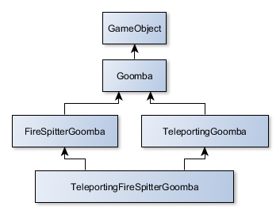
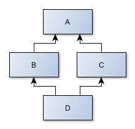
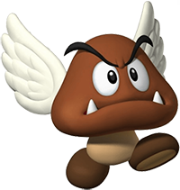

When developping a game one of the very first architectural decisions developpers have to make is to decide 
how game objects/entities will be defined. One the ways this can be implemented is by going the classic OOP way.
However, there are some major drawbacks to this route and better solutions exist such as the Entity Component System. In this article we will discuss how an Entity-Component-System can be used to overcome the pitfalls of OOP for game entities.

---

For my final Year project of my DCS in computer science, I decided to implement a game using the Entity Component System architectural pattern. In the past, I had encoutered some problems using OOP in a classic way to define the entities of my game, Entity-Component-System seemed the way to go, and in my experience, it was.


Now, before getting into the specifics of what is an Entity-Component-System and how it can be better than OOP, we'll do this:
Lets pretend we are making a game. A Super Mario Bros. on steroids. A kind of Super Mario Bros. where some of the goombas (the little brown mushrooms) can spit fire and others teleport themselves.


*This is a goomba*

If we'd go the traditional OOP way, the scenario would be something like this one:

First, we would create a class `GameObject` to represent all objects of our game. From mario, to the mushrooms
to the pipes etc.
Then, we would create a class `Goomba` inheriting `GameObject`. 
Next, we would define two more classes inheriting `Goomba`: a `FireSpitterGoomba` class and a `TeleportingGoomba` class.
Both classes would have the necessary code to respectively make the mushrooms spit fire and teleport themselves.

So far, so good. Now lets say we'd want to create a third type of mushrooms. One very special kind of mushroom.
A deadly fire spitter mushroom that is also able to teleport itself. The `TeleportingFireSpitterGoomba`

How would we do this.


If we'd use a language that support multiple inheritance such as C++, we could get away with it.
But what about languages that don't like Java. We would have two choices there:
- Inherit from `FireSpitterGoomba`and duplicate the teleporting code from `TeleportingGoomba`
- Inherit from `TeleportingGoomba`and duplicate the fire spitting code from `FireSpitterGoomba`

However, in both cases we are doing something bad, we are duplicating code. And this does not scale well at all.

Now what about a programming language that supports multiple inheritance like C++. In this case we'd have a similar problem but instead it would happen in method overriding. If a ```Goomba``` method differs in `TeleportingGoomba` and `FireSpitterGoobma`, like `Gommba.walk()` we'd have a problem: which version of the method should `TeleportingFireSpitterGoomba` use ?



*Class hierarchy*


This problem is commonly known as the deadly diamond of death. Which could be defined in simple terms as occuring when we have a diamond shaped inheritance diagram.
Such as a:
- A class `A` being parent to both classes `B` and `C`, 
- And having a class `D` inheriting from both `B` and  `C`.



*Deaddly diamond of death*


This would get even worse if we'd decide to have a `TeleportingFireSpitterMario`, imagine this.

Instead we could do this:

- Have a class named `SuperPower`.
- Have a `FireSpittingPower` inheriting `SuperPower`.
- Have a `TeleportingPower` also inheriting `SuperPower`.

Now, our Goombas woud only have to store a list of super powers available to them for use.
This way we wouldn't even need to have specialised classes for our different types of Goombas!
We'd simply take a plain Goomba and give it super powers. Not only have we overcome the deadly diamond of death, but we've just given ourselves more flexibility by allowing us to reuse powers.
We could even give our Mario character teleporting abilities.

We could even get further: We could even get rid of our classes Mario and Goomba and instead define all the charateristics that differentiate our characters in a simple list of attrributes..
We could have something like this:

```java
class GameObject {
    private ArrayList<Attribute> attributes;
    // getter & setter ...
}

class Attribute {}

class SuperPower extends Attribute {}

class FireSpitting extends SuperPower {}

class Teleporting extends SuperPower {}

```

Then, define our objects this way:

```java
GameObject teleportingGoomba = new GameObject();
teleportingGoomba.addAttribute(new TeleportingGoomba())

GameObject mario = new GameObject();
mario.addAttribute(new FireSpittingPower());
```

This is a win win sitatuion. We get rid of the diamond problem and we gain reusability.

And if we'd ever need to create a new type of power like flying or a flying mushroom ? It would get as simple as creating a `FlyingPower` class from which even Mario could benefit.


*Flying Goomba!*

As we saw, heavy inheritance is not always to best solution.
It can get complicated and out of hand very quickly. Instead of relying on it to define everything 
in our game, we used it to define parts of our game data.

And what we just did here, is getting closer to the idea of Enttiy Component System.

The Entity-Component-System is a software architecture pattern that follows the principle of *composition over inheritance*. For the rest of this article, I will simply refer to it as ECS.


ECS operates with three basic elements, each of which has a specific role: 

- Entities 
- Components 
- Systems


## Entities
An entity is in fact a concept. It is supposed to represent a precise object. If we take our previous game example, the bricks, the Goombas, Mario, Luigi, the pipes, the fire balls would all be entities. It is the equivalent of the instance of an object. It will serve as a container of components. It is the element that will give meaning to a specific set components.

## Components
The components are one of the main elements of the architectural pattern. A component cprresponds to the data describing the object. Often if one wants to be purist in its implementation, they are implemented as behaviourless structs. A few examples of game components could be this:

```cpp
struct HealthComponent {
    int amount = 100;
}

struct SpeedComponent {
    float speed = 100.0f;
}

struct SpriteComponent {
    string imageFilePath;
}

```

## Systems
A system is a specialized unit of logic operating on components only. It does not really care about what kind of entity it interacts with only with it's specific subset of components. For example the PhysicsSystem, only operates on entities having a PhysicsComponent, it does not care whether or not the entity has a graphical representation as that does not concern it's main task: calculating physics and collisions.

We divide our logic in a very clear and easy way to scale. If one wants to change the way in which our entities lose or gain health, we simply have to change a single portion of our code: the HealthSystem. It saves us a lot of bugs and therefore debugging time. Also one can benefit from optimizing the memory of our program by using contiguous memory.

## Conclusion
In short, the ECS is an alternative to classic OOP to define our data classes and behaviours in a software. It has the advantage of getting us rid of the diamond problem while giving us reusability and flexibility, which are two mandatory elements in game developpement.